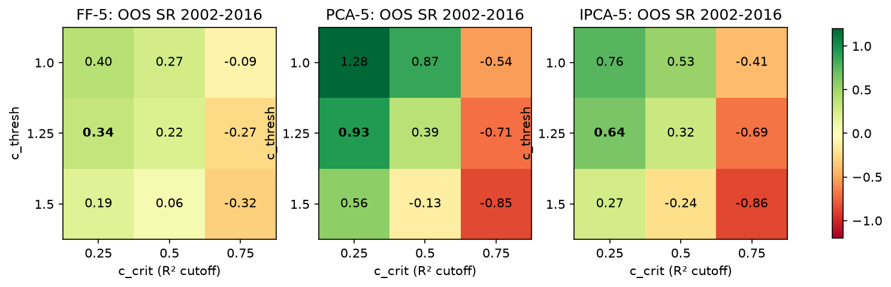
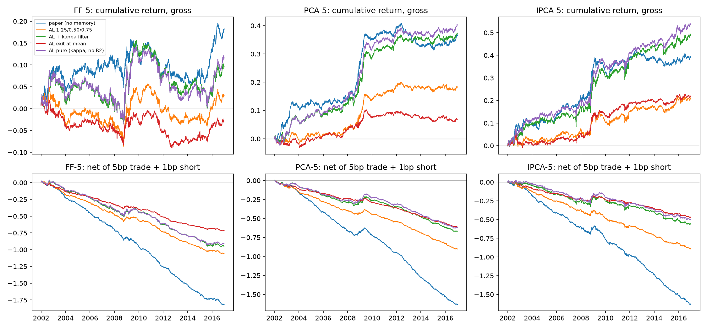
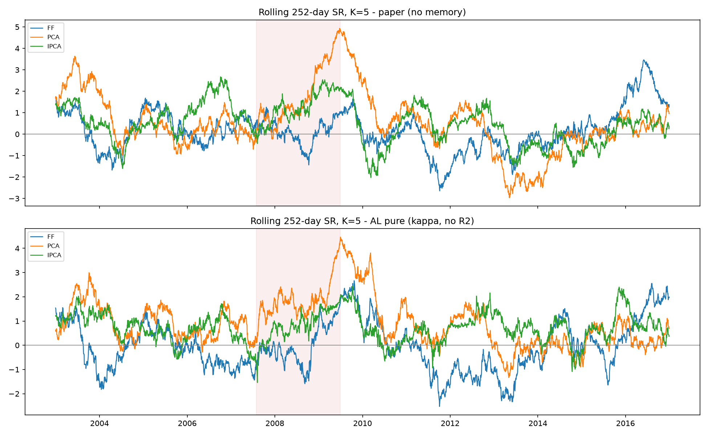
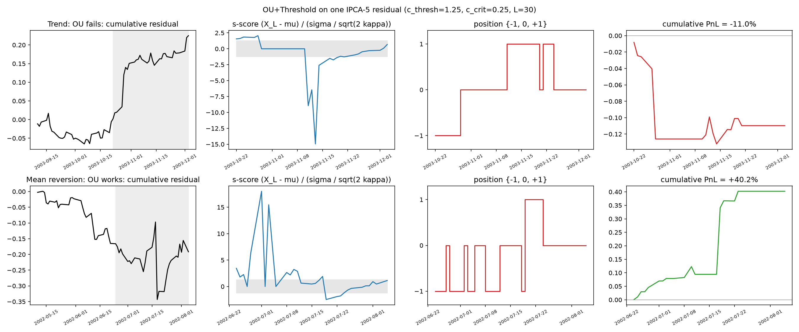
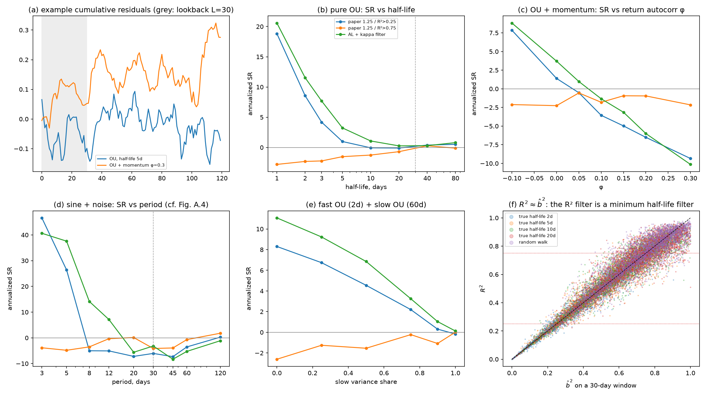

# OU+Threshold Baseline

The parametric benchmark of the paper (Section II.D.1, Appendix B.B, Table I row
"OU+Thresh"), evaluated on the official out-of-sample residuals of `gregzanotti/dlsa-public`.
The official repository ships only OU+FFN; OU+Threshold is implemented here.

## Model

A cumulative residual `X_l = sum_{j<=l} eps_{t-L+j}` over the last `L = 30` days is treated
as a discretely observed Ornstein-Uhlenbeck process

```text
dX_t = kappa (mu - X_t) dt + sigma dB_t   ==>   X_{l+1} = a + b X_l + e_l   (AR(1), dt = 1 day)
kappa = -log b,   mu = a / (1 - b),   sigma / sqrt(2 kappa) = sqrt(Var(e) / (1 - b^2))
```

The signal is `theta^OU = (kappa, mu, sigma/sqrt(2 kappa), X_L, R^2)` and the allocation is the
Avellaneda-Lee / Yeo-Papanicolaou threshold rule on the s-score `s = (X_L - mu) / (sigma / sqrt(2 kappa))`:

```text
w = -1  if s >  c_thresh and R^2 > c_crit        (residual is "rich": sell)
w = +1  if s < -c_thresh and R^2 > c_crit        (residual is "cheap": buy)
w =  0  otherwise;                                paper values c_thresh = 1.25, c_crit = 0.25
```

Implementation conventions mirror `preprocess.py:preprocess_ou` of the official code and are
pinned in `tests/test_ou.py`: only assets without a zero (= outside the universe) residual in
the window are used; only `0 < b < 1` is valid; `R^2` is the squared centered correlation of
`X_l` and `X_{l+1}`; variances are population variances. Weights are normalized to
`sum |w| = 1`; the position decided from `[t-30, t-1]` earns the residual return at `t`.

| Code | Role |
|---|---|
| `src/dlsa_baseline/models/ou.py` | `ou_signal`, paper `threshold_positions`, Avellaneda-Lee `hysteresis_positions` |
| `src/dlsa_baseline/training/ou_backtest.py` | daily backtest, cost model, `analyze_run.py`-compatible predictions |
| `src/dlsa_baseline/data/official_residuals.py` | loads official `.npy(.gz)` residuals with NYSE dates |
| `scripts/run_ou_baseline.py` | one run; writes predictions NPZ, daily CSV and metrics JSON |
| `scripts/ou_experiments.py` | `all-k`, `grid`, `rules`, `by-year`, `example` |
| `scripts/ou_synthetic.py` | controlled experiments on simulated residuals |

## Running

```bash
git clone --depth 1 https://github.com/gregzanotti/dlsa-public.git references/dlsa-public
uv run python scripts/run_ou_baseline.py --family IPCA --factors 5
uv run python scripts/analyze_run.py --predictions outputs/ou/ou_paper_ipca5_predictions.npz \
  --output-dir outputs/ou/analysis_ipca5
uv run python scripts/ou_experiments.py all      # ~2 min on an M-series CPU, no GPU needed
uv run python scripts/ou_synthetic.py            # ~1 min
```

`--rule al --kappa-filter --c-crit 0` selects the best Avellaneda-Lee variant below;
`--residuals data/processed/pca_residuals.npz` runs the same baseline on the public-data panel.
The official residual rows are exactly the 4,781 NYSE sessions 1998-01-02..2016-12-30; the
out-of-sample period is 2002-01-02..2016-12-30, as in the paper. The loader reads the
unpacked `.npy` if present (faster) and otherwise the shipped `.npy.gz`.

## Replication of Table I

OOS annualized Sharpe ratio, paper rule (`c_thresh = 1.25`, `c_crit = 0.25`); ours / paper:

| K | Fama-French | PCA | IPCA |
|---|---|---|---|
| 0 | -0.23 / -0.18 | -0.23 / -0.18 | -0.23 / -0.18 |
| 1 | 0.01 / 0.16 | 0.12 / 0.21 | 0.29 / 0.60 |
| 3 | 0.47 / 0.54 | 0.91 / 0.77 | 0.71 / 0.88 |
| **5** | **0.34 / 0.38** | **0.93 / 0.73** | **0.64 / 0.97** |
| 8 | 0.04 / 1.16 | 0.92 / 0.87 | 0.74 / 0.91 |
| 10 | - | 0.83 / 0.63 | 0.64 / 0.86 |
| 15 | - | 1.12 / 0.62 | 0.62 / 0.93 |

IPCA-5 details: mu 2.6%, sigma 4.1% (paper 3.8%, 4.0%); Newey-West (8 lags) t = 2.68 for the
mean daily return; about 870 assets pass the window filter and about 155 are held per day.

**Why numbers differ, and what was checked.**

1. *K = 0 is a clean test.* Zero factors means `eps = R` and `Phi = I`, so there is no
   stock-space mapping. We get SR -0.23, mu -2.9%, sigma 12.7% versus -0.18, -2.4%, 13.3%:
   timing, universe filter, normalization, and trade direction are right.
2. *`Phi` only rescales daily PnL.* Since `eps_t = Phi_{t-1} R_t` and the paper trades
   `w^R = Phi' w^eps / ||Phi' w^eps||_1`, its return is `w^eps' eps_t / ||Phi' w^eps||_1`; ours is
   `w^eps' eps_t / ||w^eps||_1`. The sign of every day's PnL is identical, only the day's
   leverage differs. `Phi` is not published, so the paper's exact figures cannot be matched.
3. *The PCA/IPCA swap at K = 5 is within noise.* SR(IPCA5) - SR(PCA5) = -0.29 with a
   20-day block-bootstrap standard error of 0.28; the paper's gap is 0.24. It is driven by
   2008-2009 (see below): excluding those two years gives IPCA 0.60 > PCA 0.51 > FF 0.40,
   the paper's ranking.
4. *FF K = 8 (0.04 vs 1.16) is the one large miss.* Hypothesis, not verified: FF8 contains a
   short-term reversal factor, so hedging it removes exactly the mean reversion the rule
   trades in residual space, while the paper's `Phi` normalization weights days differently.

## Cross-check with the experiment harness

`experiments/models.py:OUThreshold` (the rolling harness, `docs/full_report.md`) is an
independent torch implementation of the same rule. On identical windows the two agree
exactly (15,639 of 15,639 IPCA-5 asset-days; pinned by `experiments/test_ou_equivalence.py`),
so the numbers below differ only through the data:

| OU+Threshold, SR | FF5 | PCA5 | IPCA5 |
|---|---|---|---|
| Paper (CRSP, 2002-2016) | 0.38 | 0.73 | 0.97 |
| Official residuals, this document (2002-2016) | 0.34 | 0.93 | 0.64 |
| Harness, WIKI top-500 own residuals (2003-02 to 2016) | 0.15 | 0.62 | - |
| Harness, 50-stock sample (2020-2025) | - | -0.26 | - |

Both reproductions bracket the paper, turnover is about 1 per day in both, and both show the
alpha decaying after the mid-2000s.

## Threshold sensitivity (K = 5)



- `c_crit = 0.75` loses money everywhere (all nine family/threshold cells negative). The
  synthetic study explains why: `R^2 ~ b^2` for an AR(1), so a high `R^2` cutoff selects
  near-unit-root, trend-like windows.
- The paper's 1.25 / 0.25 is not the best cell; 1.0 / 0.25 is best for every family, but even
  the best cell (PCA 1.28) is far below CNN+Transformer (3.2-4.2 at K = 5).
- Choosing thresholds on 1998-2001 (the paper's validation logic) gives OOS SR 0.40 (FF),
  0.93 (PCA), 0.76 (IPCA) against validation SR of 2.6-3.4: tuning does not rescue OU.

## Rules and transaction costs (K = 5)

The paper rule has no memory; the original Avellaneda-Lee (2010) rule enters at `|s| > 1.25`
and exits near the mean (long closed at `s > -0.50`, short at `s < 0.75`); the kappa filter
requires a reversion time below `L / 2` (`b < exp(-2/30)`). Costs follow the official
`train_test.py`: 5 bp per unit turnover plus 1 bp on short exposure, in residual space.

| Rule | FF SR / net | PCA SR / net | IPCA SR / net | Turnover | Holding |
|---|---|---|---|---|---|
| Paper (memoryless) | 0.34 / -3.40 | 0.93 / -4.16 | 0.64 / -2.68 | 0.97 | ~1 day |
| AL 1.25 / 0.50 / 0.75 | 0.07 / -2.45 | 0.59 / -2.91 | 0.40 / -1.74 | 0.49 | 4.0 days |
| AL + kappa filter | 0.17 / -1.68 | 0.96 / -1.72 | 0.70 / -0.81 | 0.46 | 4.0 days |
| AL exit at mean | -0.08 / -2.03 | 0.27 / -2.47 | 0.52 / -1.13 | 0.26 | 7.7 days |
| **AL, kappa filter, no R^2** | 0.21 / -1.66 | **1.06 / -1.63** | **0.79 / -0.74** | 0.45 | 4.0 days |



- Hysteresis halves turnover, but longer holding alone lowers gross SR: residual mean
  reversion is very short-lived.
- The speed filter on kappa is more useful than the `R^2` filter.
- No OU variant survives costs; the break-even cost is at most ~2 bp per unit turnover
  (IPCA/PCA) and none for FF. The paper's CNN+Transformer keeps SR 1.11 net (Table IX).
  Our net figures charge costs on residual weights, not on `Phi`-mapped stock weights, so
  they are not directly comparable to Table IX.

## Stability over time (K = 5)

| SR | FF | PCA | IPCA |
|---|---|---|---|
| 2002-2007 | 0.53 | 0.92 | 0.99 |
| 2008-2009 | 0.12 | 2.74 | 0.87 |
| 2010-2016 | 0.28 | 0.09 | 0.25 |
| All excluding 2008-09 | 0.40 | 0.51 | 0.60 |
| Share of total PnL earned in 2008-09 | 7% | 57% | 27% |



PCA's lead over IPCA comes from the crisis. After 2010 the paper rule earns almost nothing and
every family has negative years (2013-2014); the kappa-filtered AL rule decays less (PCA 0.58,
IPCA 0.67 over 2010-2016). Rolling one-year SR ranges from about -3 to +5.

## Illustration (cf. Fig. A.2, bottom row)



One IPCA-5 residual traded alone with `w in {-1, 0, 1}`. Top: in an up-move the rule shorts
the start of the trend, waits while the s-score explodes, then buys at the top (-11%). Bottom:
an oscillating residual where the rule works (+40%; hand-picked as a best case, not typical).

## Synthetic experiments

Signals with known dynamics plus a random walk (2% daily vol); signal strength is calibrated
to lag-1 return autocorrelation -0.013 (real residuals about -0.02). Portfolios of 300
independent assets inflate absolute SR, so read the shapes.



1. **The R^2 filter is a minimum half-life filter** (f). For an AR(1), `R^2 ~ b^2`
   (correlation 0.93-0.98), so `R^2 > 0.75` means `b > 0.87`, an estimated half-life above
   ~5 days. It discards the fastest, most profitable reversion (b).
2. **kappa is badly biased on 30 days.** A true half-life of 20 days is estimated at 3.8
   days; a pure random walk at 4.3 days, and 18% of random-walk windows trigger a trade.
   OU sees mean reversion where there is none (small-sample AR(1) bias).
3. **The rule is a contrarian bet on return autocorrelation** (c). Momentum of `phi ~ 0.05`
   removes the edge; at `phi = 0.3` the SR is about -9. This is the Fig. A.2 failure mode.
4. **A deterministic linear trend does not break it.** On a trending window the AR(1) puts
   `mu = a / (1 - b)` far ahead of `X_L`, so the rule trades with the trend. Persistence
   (momentum), not slope, is what hurts.
5. **One frequency only** (d). Oscillations with a 3-5 day period are profitable; periods of
   8-60 days, i.e. inside the window, lose money. A flexible signal (CNN+Transformer, Fig. A.4)
   can learn several frequencies.
6. **Misspecification** (e). Mixing fast (2d) and slow (60d) OU components degrades the fit of
   the single-kappa model as the slow share grows.

## Limitations

- Residuals are traded directly with `sum |w| = 1` (no `Phi`), see point 2 above.
- On a day when an asset leaves the universe its residual is 0, so a position earns nothing
  (the paper drops such trades; footnote 10 puts them at 0.1%).
- As in the paper, the position is decided from the close of `t-1` and executed at that
  close; no execution lag is modeled.
- Synthetic results are qualitative: independent assets and stylized dynamics.
