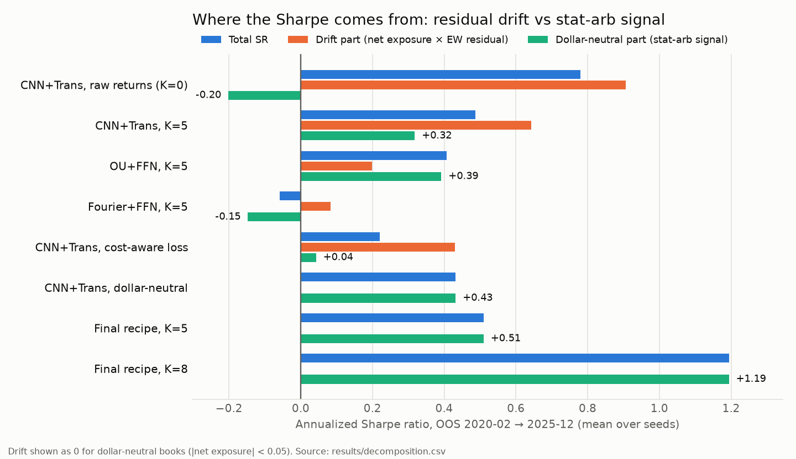
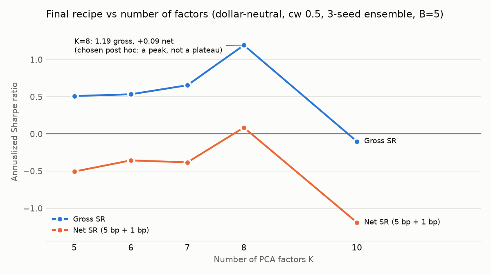

# Experiment report: Deep Learning Statistical Arbitrage on a public 49-stock sample

**Scope.** We tested the paper's design choices (Guijarro-Ordonez, Pelger, Zanotti 2022) on
the baseline's public sample, then assembled a final-model recipe for the full dataset
(`docs/final_model.md`). Full tables: `results/report_tables.md` (auto-generated). Plots:
`results/comparison_plots/` (see `docs/analysis_summary.md`) and
`results/final_model_analysis/`.

**Setup (all runs unless stated).** 49 US large caps (Yahoo, 2015–2025; PM failed to
download). Rolling-PCA residuals: 252-day covariance, 60-day loadings, K=5. Signals from
cumulative 30-day residual windows. The paper's rolling protocol: 1,000-day training window,
retrain every 125 days, fresh init, 30 epochs, Adam 1e-3. **One common out-of-sample window,
2020-02-07 → 2025-12-31 (1,483 days).** 3 seeds per trainable variant. Weights are
L1-normalized in residual space (no `Phi` mapping). Costs follow the paper: 5 bp × turnover plus 1 bp × short leg. "SR" = annualized gross
Sharpe; "net" = after costs.

**Three diagnostics we added** (used throughout):

1. **Drift decomposition** (`experiments/decompose.py`): return = net_exposure × (equal-weight
   residual) + a dollar-neutral part. In 2020–25 the equal-weight residual portfolio of these
   49 names has **SR 0.44** by itself, so any net-long model looks good for free.
2. **Dollar-neutral book** (`neutralize=True`): removes drift by construction.
3. **Selection/holdout split** (`experiments/select.py`): choose on 2020-02 → 2022-12, report
   2023-01 → 2025-12.

---

## 1. Headline

- **After the paper's costs, only one configuration is (barely) profitable on 49 stocks**:
  a dollar-neutral CNN+Transformer on K=8 residuals, trained with half the cost penalty,
  3-seed ensemble, 5-day smoothing. Gross SR 1.19 (HAC t 2.86), net SR +0.09, positive in
  both halves. K was chosen post hoc and is a peak, not a plateau (§2.10). The robust level
  of the recipe is gross SR ≈ 0.5–0.7 with net SR ≈ −0.4 to −0.5 (K = 5–7).
- **The paper's central qualitative claim reproduces**: signal extraction is what separates
  models. In a drift-free book only CNN+Transformer has a positive signal (0.43 vs ≤ 0.11 for
  Fourier+FFN, OU+FFN, raw FFN, OU+Threshold, reversal).
- **Naive results are misleading here.** Several apparently strong settings (raw returns
  K=0: SR 0.78, HAC t 2.3; the cost-aware objective) are mostly or entirely residual drift,
  not arbitrage.
- The magnitude gap vs the paper (SR 3–4 gross, 1–1.2 net) is expected: with ~550 names,
  the paper diversifies hundreds of weakly correlated residual bets per day; we have 49.



## 2. Results by suite

### 2.1 Signal models, `models` + `neutral` (paper Table I / A.IX)

| model               | SR (net-long book) | neutral part of it | SR, dollar-neutral book | turnover (neutral) | SR net (neutral) |
| ------------------- | -----------------: | -----------------: | ----------------------: | -----------------: | ---------------: |
| **CNN+Transformer** |        0.49 ± 0.16 |               0.32 |         **0.43 ± 0.16** |               1.10 |            −2.91 |
| Fourier+FFN         |       −0.06 ± 0.49 |              −0.15 |             0.11 ± 0.17 |               0.65 |            −1.94 |
| OU+FFN              |        0.41 ± 0.52 |               0.39 |             0.10 ± 0.06 |               0.47 |            −1.22 |
| raw FFN             |       −0.11 ± 0.34 |              −0.18 |            −0.10 ± 0.16 |               0.30 |            −0.90 |
| reversal            |               0.04 |               0.05 |                    0.05 |               0.24 |            −0.63 |
| OU+Threshold        |              −0.26 |              −0.27 |                       – |               1.06 |            −1.95 |

Unconstrained models are net long (CNN +0.76). OU+FFN's 0.41 was mostly drift: it falls to
0.10 when neutral. The raw FFN collapses to near-static weights (turnover 0.04).

### 2.2 Number of factors, `factors` (paper Table I)

| K               | CNN+Trans SR | CNN neutral part | Fourier+FFN SR | OU+Thresh SR |
| --------------- | -----------: | ---------------: | -------------: | -----------: |
| 0 (raw returns) |  0.78 ± 0.04 |        **−0.20** |    0.56 ± 0.39 |        −0.35 |
| 1               |  0.51 ± 0.19 |             0.26 |    0.45 ± 0.16 |        −0.35 |
| 3               |  0.01 ± 0.11 |            −0.35 |    0.17 ± 0.38 |        −0.18 |
| **5**           |  0.49 ± 0.16 |         **0.32** |   −0.06 ± 0.49 |        −0.26 |
| 8               |  0.43 ± 0.45 |         **0.45** |    0.06 ± 0.26 |        −0.02 |
| 10              | −0.15 ± 0.29 |            −0.20 |   −0.30 ± 0.43 |        −0.13 |
| 15              | −0.02 ± 0.26 |            −0.11 |   −0.13 ± 0.46 |        −0.34 |

K=0 has the best total SR and a "significant" HAC t of 2.3, but σ = 17%, max drawdown −20%,
and a **negative** neutral part. It is a levered long position on a rising market. On the
arbitrage component, residuals beat raw returns, as the paper says. The sweet spot is
K = 5–8. K = 10–15 removes too much of a 49-name cross-section and the signal disappears.
K=8 has the largest neutral part (0.45) but 3× the seed sd of K=5 (0.45 vs 0.16).
Below K=5 the results are noisy (K=3 ≈ 0). The final-model check of K=8 is in §2.7.

### 2.3 Objective, `objective` (paper Tables III, IX) + cost weight, `final`

| objective           |   SR | neutral part | net exposure | turnover | SR net |
| ------------------- | ---: | -----------: | -----------: | -------: | -----: |
| Sharpe              | 0.49 |         0.32 |         0.76 |     0.71 |  −2.46 |
| mean-variance (γ=1) | 0.24 |         0.18 |         0.20 |     1.14 |  −2.87 |
| Sharpe net of costs | 0.22 |     **0.04** |     **0.97** |     0.14 |  −0.43 |

With costs in the loss, the unconstrained model turns into **buy-and-hold of residuals**
(net exposure 0.97, no neutral signal). Its "best net SR" is drift. In the neutral book:

| cost_weight in loss (neutral CNN) |     0 |  0.25 |   0.5 |   1.0 |
| --------------------------------- | ----: | ----: | ----: | ----: |
| SR (seed mean)                    |  0.43 |  0.43 |  0.24 | −0.04 |
| turnover                          |  1.10 |  0.86 |  0.52 |  0.26 |
| SR net                            | −2.91 | −2.21 | −1.53 | −1.08 |

The full penalty kills the signal. Half the penalty halves turnover and keeps part of the
signal, which the seed ensemble and smoothing then recover (§2.7: cw 0.5 → 0.51 at B=5).

### 2.4 Lookback, `lookback` (paper Table V)

| L            |    10 |    20 |   **30** |   60 |
| ------------ | ----: | ----: | -------: | ---: |
| SR           |  0.11 | −0.10 | **0.49** | 0.33 |
| neutral part | −0.01 | −0.26 | **0.32** | 0.22 |

L=30 is best, consistent with the paper. L=60 is close, as the paper found.

### 2.5 Epoch budget, `epochs`

| epochs       |    10 |   **30** | 100 (paper) |
| ------------ | ----: | -------: | ----------: |
| SR           | −0.04 | **0.49** |        0.37 |
| neutral part | −0.23 | **0.32** |        0.24 |

100 epochs overfit on 1,000 days × 49 names. Re-calibrate on the full dataset.

### 2.6 Protocol, `protocol` (paper Table VII), and architecture, `architecture` (Table A.IV)

**Protocol** (CNN+Trans, K=5; all rolling/constant runs share the 2020-02 → 2025-12 OOS):

| protocol                                                     |       SR | neutral part | seed sd | SR net |
| ------------------------------------------------------------ | -------: | -----------: | ------: | -----: |
| **rolling, 1,000-day window** (paper)                        | **0.49** |     **0.32** |    0.16 |  −2.46 |
| rolling, 750                                                 |     0.42 |         0.30 |    0.24 |  −2.38 |
| rolling, 500                                                 |     0.13 |         0.06 |    0.38 |  −2.58 |
| constant (train once on the first 1,000 days)                |     0.22 |         0.08 |    0.12 |  −2.71 |
| fixed 60/20/20 + early stopping (baseline; OOS 2024–25 only) |    −0.53 |        −0.44 |    0.61 |  −2.66 |

Retraining helps (rolling 0.49 vs constant 0.22), and longer training windows are better,
as in the paper's Table VII. The baseline's single split is the weakest. Its reported SR
0.68 was one seed, 10 epochs.

**Architecture** (paper Table A.IV perturbations):

| architecture                                  |       SR | neutral part | seed sd | SR net |
| --------------------------------------------- | -------: | -----------: | ------: | -----: |
| **D=8, 4 heads, ff 16, dropout 0.25** (paper) | **0.49** |     **0.32** |    0.16 |  −2.46 |
| D=8, 2 heads                                  |     0.37 |         0.19 |    0.17 |  −2.55 |
| D=8, dropout 0.5                              |     0.28 |         0.07 |    0.22 |  −2.39 |
| D=16, ff 32, dropout 0.5                      |     0.19 |         0.04 |    0.39 |  −3.00 |

The paper's parsimonious default is best. Larger or more regularized nets lose the signal
on this small sample.

### 2.7 Ensembling and smoothing, `postprocess` on `final` (paper III.M persistence)

Dollar-neutral CNN, 3-seed weight ensemble, causal B-day smoothing of target weights. Full
OOS gross SR (turnover):

| cost_weight \ B |            1 |               3 |           5 |           10 |           20 |
| --------------- | -----------: | --------------: | ----------: | -----------: | -----------: |
| 0               |  0.54 (1.07) | **0.73** (0.58) | 0.58 (0.43) |  0.25 (0.29) | −0.05 (0.19) |
| 0.25            |  0.48 (0.86) |     0.72 (0.47) | 0.56 (0.35) |  0.26 (0.23) |  0.04 (0.15) |
| 0.5             |  0.37 (0.63) |     0.54 (0.36) | 0.51 (0.27) |  0.28 (0.18) |  0.27 (0.13) |
| 1.0             | −0.13 (0.40) |     0.06 (0.25) | 0.02 (0.19) | −0.23 (0.13) | −0.37 (0.10) |

Short smoothing (B = 3–5) _raises_ the gross SR and halves turnover. The daily signal is
noisy but persistent over a few days, matching the paper's ~7-day half-life.

### 2.8 Honest selection

Choosing on 2020–22 and reporting 2023–25 (dollar-neutral ensembles only):

- The **argmax** of selection-period net SR (cw 0.5, B 20: −0.03) **fails in the holdout**
  (net −0.66, gross −0.09). Long smoothing fit the 2020–22 regime.
- **Stable in both periods:** B ∈ {3, 5} > B = 1, and cw ∈ {0.25, 0.5} > {0, 1}. Most
  consistent point: **cw 0.5, B 5** (selection 0.54 / −0.56, holdout 0.48 / −0.46). This is
  the final recipe. The holdout has now been viewed, so the full dataset is the true test.
- Across all runs, gross-SR ranks barely persist between periods (Spearman 0.15). Net-SR
  ranks do (0.66), but only because turnover is persistent.

### 2.9 Final model statistics (full OOS)

**K=5 recipe** (`results/final_model_analysis/`): SR 0.51, HAC t 1.26, μ 2.4%, σ 4.6%, max drawdown −7.1%, turnover 0.27/day, net SR −0.51.
Every year positive gross (2020 2.6%, 2021 0.5%, 2022 4.0%, 2023 1.0%, 2024 4.0%, 2025 1.4%).
PSR 0.89. **Deflated SR probability 0.22** (117 trials → expected max SR from luck 0.83).
Min. track record 2,652 days vs 1,483 observed. Break-even cost 3.4 bp (baseline: 1.1 bp).
The baseline analyzer's verdict: **insufficient statistical evidence**.

**K=8 variant** (`results/final_model_k8_analysis/`): SR 1.19, HAC t 2.86, μ 4.6%, σ 3.8%,
max drawdown −4.0%, turnover 0.24/day, net SR +0.09. Gross return every year (2020 10.2%,
2021 0.9%, 2022 1.7%, 2023 4.8%, 2024 3.4%, 2025 6.4%). PSR 0.998. **Deflated SR probability
0.69** (144 trials → expected max SR from luck 0.99). Min. track record 472 days. Break-even
cost 7.7 bp on turnover (the 1 bp short-leg holding cost adds ~1.3%/yr on top). Verdict:
**strong engineering evidence**. It fails only "positive SR after 10 bp". Selection bias on K
is the main reservation; see §2.10.

### 2.10 K robustness of the final recipe (post hoc)

K=8 was added to `final` because `factors` (full OOS) showed its neutral part to be the
largest. Neighbours then tested whether it is a plateau. Recipe: neutral, cw 0.5, 3-seed
ensemble.

| K                          |         5 |          6 |          7 |         **8** |         10 |
| -------------------------- | --------: | ---------: | ---------: | ------------: | ---------: |
| gross SR, B=5              |      0.51 |       0.53 |       0.66 |      **1.19** |      −0.10 |
| net SR, B=5                |     −0.51 |      −0.36 |      −0.38 |     **+0.09** |      −1.19 |
| holdout gross SR, B = 1…20 | 0.01…0.48 | −0.06…0.44 | −0.01…0.55 | **0.53…1.25** | −0.52…0.16 |

K=8 is stable **over time and over smoothing** (best holdout at every B) but **not over K**.
Gross SR rises gently over K = 5–7, then jumps at 8 and collapses at 10. Our reading: there
is a real gradient toward K ≈ 7–8 in this 49-name universe, plus luck at exactly 8. The
strict selection rule (argmax selection-period net SR over K × B) picks K=6/B=20 (+0.45),
which **fails in the holdout** (−0.60). Long smoothing overfits again. Hence the recipe
tunes K ∈ {5, 8} on the full data's validation span rather than fixing K=8.



## 3. Hypotheses from `docs/paper_summary.md`

| #   | Hypothesis (paper)                                       | Verdict on the 49-stock sample                                                                                                                                                                                                                                                          |
| --- | -------------------------------------------------------- | --------------------------------------------------------------------------------------------------------------------------------------------------------------------------------------------------------------------------------------------------------------------------------------- |
| H1  | Signal extraction matters most: CNN+Trans > Fourier > OU | **Supported, weakly.** Clear in the drift-free book (0.43 vs ~0.1); not significant.                                                                                                                                                                                                    |
| H2  | Residuals beat raw returns (K=0)                         | **Supported on the arbitrage component** (neutral part K=0 −0.20 vs K=5 0.32). **Reversed on total SR** because of market drift.                                                                                                                                                        |
| H3  | Performance plateaus for K ≥ 5                           | **Partly.** The sweet spot is K = 5–8 (neutral part 0.32–0.45). With only 49 names, K ≥ 10 removes the signal (neutral part < 0), like the paper's PCA decline at K=15. Below 5, results are noisy (K=3 ≈ 0).                                                                           |
| H4  | L=30 ≈ L=60                                              | **Supported** (0.49 vs 0.33; neutral 0.32 vs 0.22). Shorter windows are worse.                                                                                                                                                                                                          |
| H5  | Rolling retraining beats a constant model                | **Supported.** Rolling 1,000/125: SR 0.49 (neutral part 0.32) vs constant model 0.22 (0.08). Shorter windows (500) are worse.                                                                                                                                                           |
| H6  | Profits survive costs when costs are in the objective    | **Mostly not supported on 49 stocks.** Cost-aware training alone either kills the neutral signal (cw=1) or becomes drift (unconstrained). Only the combination of half-weight costs, dollar-neutrality, ensembling and 5-day smoothing reaches net SR ≈ 0 (K=5–7: −0.4) to +0.09 (K=8). |     |
| H7  | Strategy is orthogonal to the market                     | **Only in the dollar-neutral book.** Unconstrained models load on residual drift (corr. with the EW residual up to 0.75).                                                                                                                                                               |

## 4. Lessons for the full-dataset run

1. **Always report the drift decomposition** or trade a dollar-neutral book. Otherwise
   "stat-arb" performance can be market drift.
2. **Keep costs in the loss but soften them** (cw ≈ 0.5), and **smooth execution** over 3–5
   days. Together they cut turnover about 4× while keeping most of the signal.
3. **Ensemble seeds.** Single-seed SR sd ≈ 0.16 is as large as the effect on this sample.
4. **Select on an early validation span only**, and count trials (Deflated SR).
5. Re-calibrate epochs; 100 overfit here.
6. **Tune K** (5 vs 8) on validation only. Long smoothing (B ≥ 10) and strict argmax
   selection repeatedly overfit the 2020–22 regime on this sample.

## 5. Reproduce

```bash
uv sync --frozen && uv run python scripts/download_sample_data.py \
  && uv run python scripts/build_pca_residuals.py
for s in models factors neutral objective lookback epochs protocol architecture final; do
  uv run python -m experiments.run_suite $s; done
uv run python -m experiments.postprocess --suite final \
  models__cnn_transformer neutral__cnn_transformer_neutral neutral__ou_ffn_neutral
uv run python -m experiments.decompose
uv run python -m experiments.select
uv run python -m experiments.report_tables
uv run python -m experiments.figures
uv run python -m analysis.compare_runs \
  --results-dir results --output-dir results/comparison_plots
```

Compute: ~5 h on an Apple-silicon laptop (MPS), CNN runs dominate.
